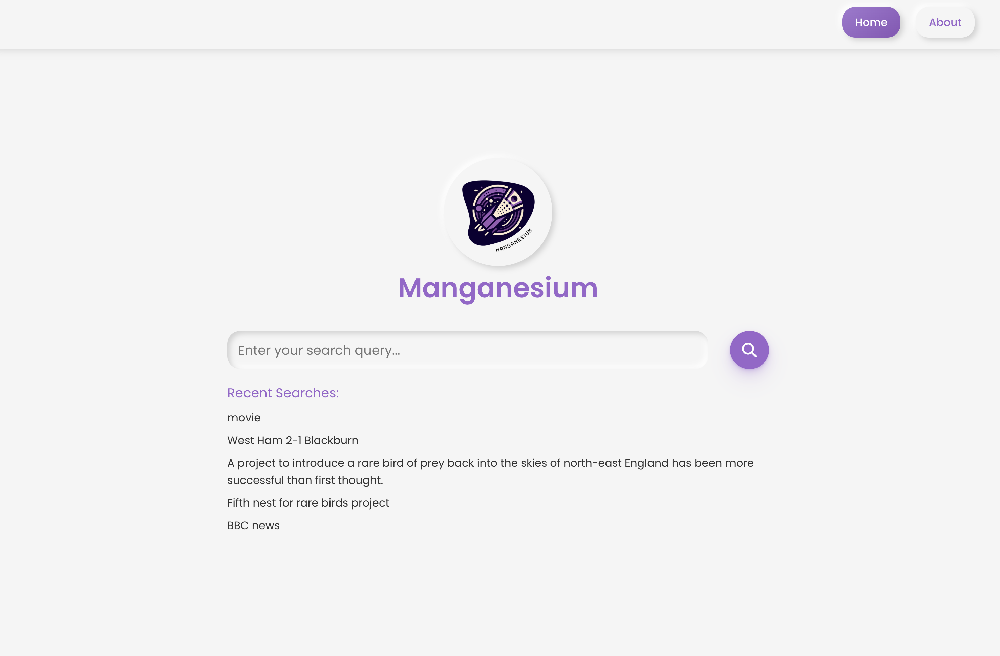
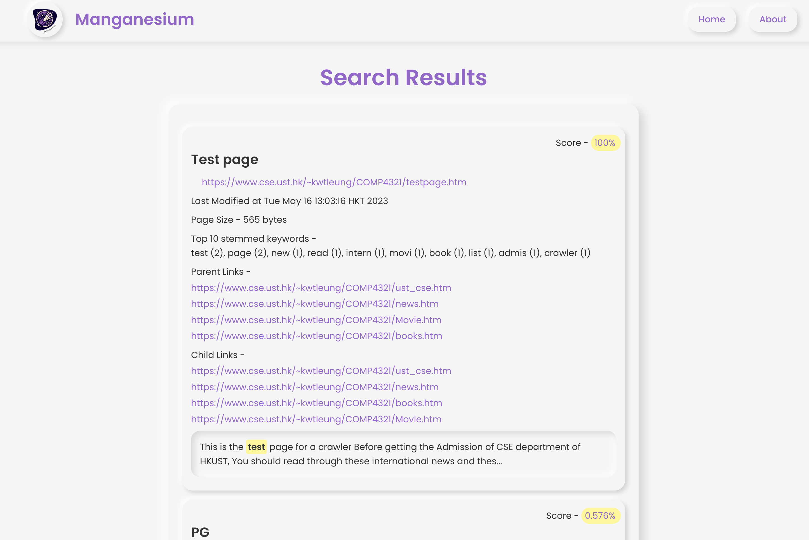

# COMP4321 Group 25 - Manganesium
# ** !ALL DOCUMENTS ARE INSIDE /docs DIRECTORY, PLEASE DO NOT IGNORE THEM**


## Project Description
This project is a comprehensive application developed as part of the COMP4321 course by Group 25. The application leverages multiple technologies and frameworks to deliver a robust and efficient solution.
Design documents and other project-related files can be found in the [docs](docs) directory.
## Table of Contents
- [Technologies Used](#technologies-used)
- [Installation](#installation)
- [Usage](#usage)
- [Contributing](#contributing)
- [License](#license)
```
Manganesium
├── app
│   ├── Purpose: Integrates and runs the full pipeline (crawler, indexer, and test program for Phase 1; search and web later)
│   ├── Usage: Executes main workflow, generates spider_result.txt for Phase 1
│   └── Dependencies: crawler, indexer, utils (later: search, web)
├── crawler
│   ├── Purpose: Crawls web pages and stores metadata/links in the database
│   ├── Usage: Fetches 30 pages (Phase 1) or 300 pages (Final), populates db.pages, urlToPageId, parentToChildLinks, childToParentLinks
│   └─── Dependencies: utils, indexer
├── indexer
│   ├── Purpose: Indexes pages from the database for search functionality
│   ├── Usage: Builds inverted, forward indexes (bodyInvertedIndex, titleInvertedIndex) and documentFrequency from db.pages
│   └── Dependencies: utils
├── search
│   ├── Purpose: Implements the search engine backend (not in Phase 1)
│   ├── Usage: Queries inverted indexes for ranked results (Final Submission)
│   └── Dependencies: utils (later: indexer for db access)
├── utils
│   ├── Purpose: Provides shared utilities for all modules
│   ├── Usage: Reusable code for database access, and other common tasks
│   └── Dependencies: None (standalone)
└─── web
    ├── Purpose: Front-end interface for search engine (not in Phase 1)
    ├── Usage: Displays search results via a web UI (Final Submission)
    ├── Dependencies: search, utils
    └── Files: (TBD for Final Submission)
```
## Technologies Used
The project is built using the following technologies:
- **Vue.js & Vite** (frontend)
- **Kotlin** (backend)
  - MapDB
  - Jsoup
  - Gradle
  - JUnit
  - SLF4J
  - Kotlin-Logging
  - Logback
  - Mockito
  - Ktor

## Installation
To install and run this project locally, follow these steps:

1. **(Optional if you have the repo zip) Clone the repository**:
    ```bash
    git clone https://github.com/waydxd/COMP4321-Group25.git
    ```

2. **Navigate to the project directory**:
    ```bash
    cd COMP4321-Group25
    ```

3. **Install dependencies**:
    - For the Vue.js frontend (Not implemented in phase 1):
      ```bash
      cd web
      npm install
      ```
    - For the Kotlin backend:
      ```bash
      ./gradlew build
      ```
      or if you have gradle installed:
      ```bash
      gradle build
      ```

## Usage
To run the *project test program* for **Phase 1**, follow these steps:
```bash
./gradlew runTest
``` 
or if you have gradle installed:
```bash
gradle runTest
```
then the `crawler.db`, `indexer.db` and `spider_test.txt` will be generated in the root directory.

Alternatively, you can run the test program by running the `Main.kt` file in the `app/src/main/kotlin` directory using IntelliJ IDEA.

To run the **search engine backend** for **Final Phase**, follow these steps:
```bash
./gradlew run
```
or if you have gradle installed:
```bash
gradle run
```
Then the search engine will start crawling first and then the api listener will start listening on port 8080. You can access the api by navigating to `http://localhost:8080/api/health` in your web browser.

You can specify port by setting the `PORT` environment variable. For example, to run the backend on port 8081, you can run:
```bash
PORT=8081 gradle run
```
_Note that if you changed to use ports other than 8080. You will need to specify the backend address in web/.env in order to let the frontend to bind it. 
An example .env.default has been provided for you for reference._

For the frontend vue app, navigate to the `web` directory and run the following command:
```bash
npm run build
npm run preview
```
or if you have vite installed globally:
```bash
vite build
vite preview
```
Then the frontend website will be available at `http://localhost:4173` in your web browser.

For simplicity, a run.sh has been made to run the backend and frontend at the same time. To run the script, navigate to the root directory and run:
```bash
chmod +x run.sh
./run.sh
```
## Contributing
Contributions are welcome! Please follow these steps to contribute:

1. **Fork the repository**.
2. **Create a new branch**:
    ```bash
    git checkout -b feature/your-feature-name
    ```
3. **Make your changes and commit them**:
    ```bash
    git commit -m 'Add some feature'
    ```
4. **Push to the branch**:
    ```bash
    git push origin feature/your-feature-name
    ```
5. **Create a new Pull Request**.

## License
This project is licensed under the GPL-3.0 license. See the [LICENSE](LICENSE) file for details.
